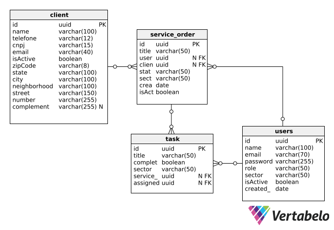

## ❔ Explicação do projeto  

O desafio do quarto semestre consiste no desenvolvimento de uma sistema, chamado Logflow, que permita o acompanhamento de diversas ordens de serviços em diferentes setores e etapas durante o atendimento da empresa JJM Log

## 👀 Demonstração do produto
➯ [Vídeo de demonstração](https://www.youtube.com/watch?v=8bnKvWPvFwc)

## 📄 Backlog
➯ Acesse o backlog completo [aqui](https://cold-spice-64e.notion.site/12128f34d09580f5a685f331ad284884?v=12128f34d09581d790f6000c6fa5996d&pvs=4)

## 📋 Requisitos
#### ➯ Funcionais
| Nº do requisito | Requisito do Parceiro                                                                                                                         |
| ------------------- | ----------------------------------------------------------------------------------------------------------------------------------------------- |
| RF1                 | Sistema de fluxo de trabalho de Ordens de Serviço, onde seja possível acompanhar o andamento e cumprimento de tarefas relacionadas                                                                       |
| RF2                 | Portal do funcionário que permita acessar informações importantes, visualizar tarefas atribuídas subir documentos como holerits, atestados, etc.                                                                                                                           |
| RF3                 | Desenvolver um Dashboard de indicadores de desempenho para cada departamento (operacional; comercial; financeiro)                               |
| RF4                 | Desenvolver um index(base de dados) onde os setores da empresa possam acessar docs e planilhas importantes online                                                 |
| RF5                 | Desenvolver de uma base de dados para roteirização de viagens a partir da localização dos agentes existentes( para prospectar clientes em regiões novas) |
| RF6                 | Desenvolver um sistema de agenda, onde possa ser marcado compromissos e prazos para o cumprimento de tarefas e ordens de serviço                                                                                                                                          |
| RF7                 | Desenvolver um chat onde funcionários possam se comunicar dentro do sistema                                                                                                                                       |

#### ➯ Não funcionais
| Nº do Requisito | Requisito do Parceiro                                      |
| ------------------- | ---------------------------------------------------------- |
| RNF1                | Desenvolver uma base de dados externa                                      |
| RNF2                | Application Programming Interface (API)                    |
| RNF3                | Permitir acesso para computadores e aparelhos celulares, sem comprometimento de funcionalidades |

## 📅 Planejamento de Entregas

## 🧰 Tecnologias utilizadas
- [Next.js](https://nextjs.org)
- [React](https://react.dev)
- [TailwindCSS](https://tailwindcss.com)
- [DaisyUI](https://daisyui.com)
- [NestJS](https://nestjs.com)
- [Node.js](https://nodejs.org/pt)
- [Typescript](https://www.typescriptlang.org)
- [PostgresSQL](https://www.postgresql.org)
- [Swagger](https://swagger.io)
- [Docker](https://www.docker.com)

  
## 🛠️ Outras Ferramentas utilizadas
- [Trello](https://www.trello.com)
- [Figma](https://www.figma.com)
- [Postman](https://www.postman.com)

## Modelo de Banco de Dados

  

O diagrama acima apresenta o modelo de banco de dados utilizado neste projeto. Ele foi gerado utilizando a ferramenta Vertabelo e é implementado com o PostgreSQL. As principais entidades incluem:

- **Client**: Armazena informações dos clientes, como nome, telefone, CNPJ, e endereço completo.
- **Users**: Representa os usuários do sistema, contendo dados como nome, e-mail, senha e função.
- **Service Order**: Gerencia as ordens de serviço, relacionadas tanto aos clientes quanto aos usuários responsáveis.
- **Task**: Define as tarefas associadas a cada ordem de serviço, incluindo o usuário designado e o setor responsável.

Cada entidade possui chaves primárias e estrangeiras para manter a integridade dos relacionamentos e facilitar as consultas complexas no sistema.

## 👨‍💻 Integrantes da Equipe

  
|Nome|Função|GitHub|Linkedin|
| -------- |-------- |-------- |-------- |
|**Bruno Silvério**|Product Owner|[@GitHub](https://github.com/BrunoVieira30)|[@Linkedin](https://www.linkedin.com/in/bruno-vieira-b999a2224/)
|**Cauã Dezidera**|Desenvolvedor|[@GitHub](https://github.com/CauaDezidera)|[@Linkedin](https://www.linkedin.com/in/cauã-dezidera-375736275/) 
|**Mateus Madeira**|Desenvolvedor|[@GitHub](https://github.com/mafemad)|[@Linkedin](https://www.linkedin.com/in/mateus-ferreira-madeira)
|**Pedro Kajiya**|Desenvolvedor|[@GitHub](https://github.com/kajiyap)|[@Linkedin](https://www.linkedin.com/in/pedro-santos-kajiya-65763b260/)
|**Abner Machado**|Desenvolvedor|[@GitHub](https://github.com/abnerdouglas)|[@Linkedin](https://www.linkedin.com/in/abner-douglas-a70a9b199/)
|**Erick Hideki**|Scrum Master|[@GitHub](https://github.com/erickhoawata)|[@Linkedin](http://linkedin.com/in/érick-awata)
|**Ryan Seiji Wakugawa**|Desenvolvedor|[@GitHub](https://github.com/ryan-wakugawa)|[@Linkedin](https://www.linkedin.com/in/ryan-wakugawa-526bbb27a)

   
  

